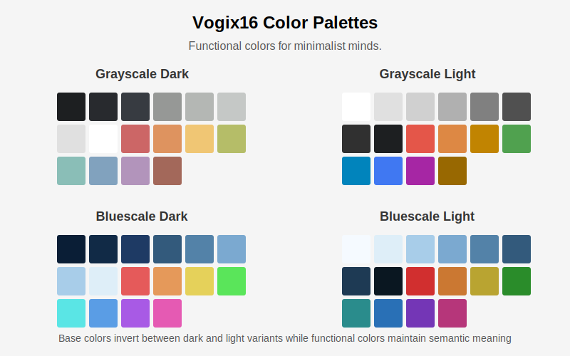

# Vogix16 Design System

> Functional colors for minimalist minds.

## Vogix16 Definition

Vogix16 is inspired by Base16, but with key differences:

### Base Colors (Monochromatic UI Foundation)
- **base00**: Background - Primary surface color (darkest in dark mode, lightest in light mode)
- **base01**: Alternative Surfaces - Secondary panels, cards, subtle containers
- **base02**: Subtle Highlights - Hover states, inactive selections, subtle differentiators
- **base03**: Muted Elements - Secondary information, disabled content, placeholders
- **base04**: Borders & Dividers - Separators, outlines, structural elements
- **base05**: Body Text - Primary content text and interface elements
- **base06**: Emphasized Content - Headings, highlighted content, important text
- **base07**: High Contrast Elements - Highest visibility elements (lightest in dark mode, darkest in light mode)

### Functional Colors (Semantic Purpose Colors)
- **base08**: Error/Danger - Error states, destructive actions, critical alerts
- **base09**: Warning/Caution - Warning indicators, important notifications, cautionary elements
- **base0A**: Notice/Attention - Status notifications, announcements, noteworthy information
- **base0B**: Success/Confirmed - Success states, completed actions, positive indicators
- **base0C**: Active/Current - Current selection, active element, focused content
- **base0D**: Information/Interactive - Clickable elements, links, primary actions, informational content
- **base0E**: Focus/Highlight - Focus indicators, highlighted content, secondary actions
- **base0F**: Special States - System messages, specialized indicators, tertiary elements

> **Important**: Vogix16 defines functional colors by their semantic purpose, not by specific hues. While traditional color associations (red for errors, green for success) may be used, they are not required. What matters is that each functional color maintains its semantic meaning consistently across all interfaces and themes.

### Key Differences from Base16

1. **Monochromatic Base**: The base colors (base00-base07) form a monochromatic scale but aren't limited to grayscale. They can be any color family (green, blue, sepia, etc.), as long as they form a cohesive progression from darkest to lightest (or vice versa for light themes).

2. **Dark and Light Variants**: Themes have both dark and light variants. In dark variants, base00 is the darkest color and base07 is the lightest. In light variants, this is reversed: base00 is the lightest and base07 is the darkest.

3. **Strict Functional Color Usage**: Colors are assigned based on semantic function rather than aesthetics. Each functional color has a consistent purpose (e.g., base08 always represents errors/danger) even if the actual color used varies between themes.

