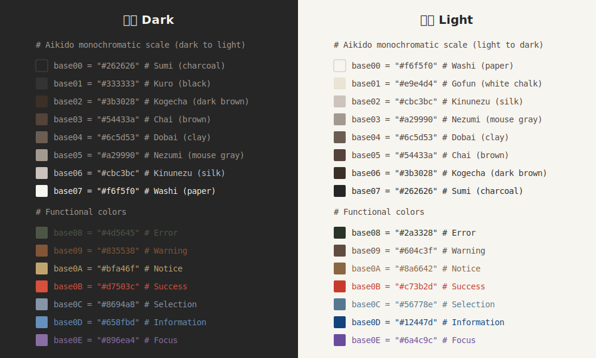
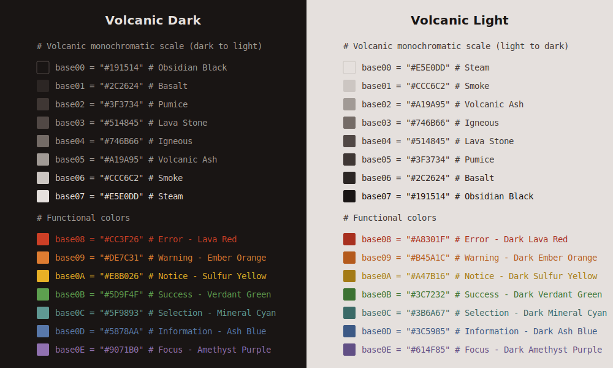
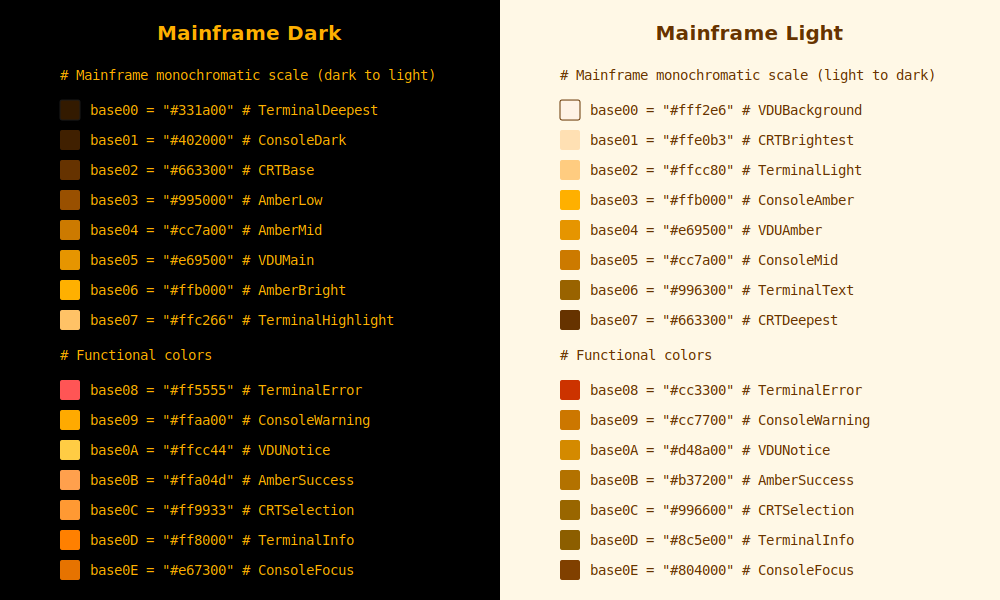

# Vogix Themes

> Functional colors for minimalist minds.

Vogix supports 4 color schemes. This document catalogs the native vogix16 themes and describes imported theme sources.

## Theme Sources

| Scheme | Count | Source |
|--------|-------|--------|
| **vogix16** | 19 | Native themes in `themes/vogix16/*.nix` |
| **base16** | ~300 | [tinted-schemes](https://github.com/i-am-logger/tinted-schemes) (forked) |
| **base24** | ~180 | [tinted-schemes](https://github.com/i-am-logger/tinted-schemes) (forked) |
| **ansi16** | ~450 | [iTerm2-Color-Schemes](https://github.com/i-am-logger/iTerm2-Color-Schemes) (forked) |

## Imported Themes

### base16 and base24

Imported from the [tinted-schemes](https://github.com/i-am-logger/tinted-schemes) repository. Popular themes include:

- **catppuccin** (4 variants: latte, frappe, macchiato, mocha)
- **dracula** (1 variant)
- **gruvbox** (multiple variants)
- **nord** (1 variant)
- **solarized** (2 variants: light, dark)
- **tokyo-night** (multiple variants)

Use `vogix list -s base16` or `vogix list -s base24` to see all available themes.

### ansi16

Imported from the [iTerm2-Color-Schemes](https://github.com/i-am-logger/iTerm2-Color-Schemes) repository. These follow the traditional ANSI terminal color standard.

Use `vogix list -s ansi16` to see all available themes.

## Native vogix16 Themes

The vogix16 scheme themes follow the semantic design philosophy where colors convey functional meaning.

### Natural Themes

> Natural themes draw inspiration from organic materials and environments, featuring earthy tones and harmonious color combinations.

#### Aikido (Japanese) Theme

*A balanced theme inspired by traditional Japanese aesthetics with muted greens and warm accents.*

#### Sepia Theme

*Warm browns and amber tones create a vintage paper-like appearance with subdued functional indicators.*

#### Green Theme

*Refreshing forest-inspired palette with vibrant emerald tones and complementary functional colors.*

#### Nordic Theme

*A Scandinavian-inspired theme with slate blues and cool grays, featuring amber tones for information and arctic blues for success states, inverting traditional color associations.*

#### Desert Theme

*An arid landscape-inspired palette with sand and terracotta tones, using warm clay colors for success states and sage greens for errors, with canyon orange for information.*

#### Forest Night Theme

*A nocturnal forest-inspired theme with deep green to moonlit silver progression, featuring bioluminescent mushroom colors for errors, moonlit blue tones for success states, and dark tree bark browns for information.*

#### Ocean Depths Theme

*A deep sea-inspired theme with abyssal blues transitioning to bioluminescent whites, featuring jellyfish-blue for success, red plankton for error states, and various bioluminescent colors for functional indicators.*

#### Arctic Aurora Theme

*A northern lights-inspired theme with polar night blues transitioning to aurora-lit snow, featuring aurora green for errors and deep polar night blue for success states, intentionally inverting traditional color associations to mirror the ethereal quality of the northern skies.*

#### Volcanic Theme

*A geologically-inspired theme with obsidian black to volcanic ash progression, featuring magma red for errors, sulfur yellow for warnings, mineral blue for success states, and geothermal steam blue-grey for information.*

#### Crystal Cave Theme

*A gemstone-inspired theme with deep cave shadows to crystalline white progression, featuring amethyst purple for errors, citrine amber for warnings, aquamarine blue-green for success states, and rose quartz pink for information, creating a magical subterranean atmosphere rich with mineral brilliance.*

### Hacker Themes

> Hacker themes evoke the aesthetic of classic computer terminals and cyberpunk interfaces, featuring monochromatic glows reminiscent of old CRT monitors and command-line environments.

#### Matrix Theme

*A classic hacker aesthetic with phosphor green on deep black, featuring bright system indicators that mimic old CRT terminal displays with a subtle glow effect.*

#### Cyberspace Theme

*A digital frontier aesthetic with electric cyan on deep black, featuring neon-bright system indicators that evoke cyberpunk interfaces with a distinctive CRT glow effect.*

#### Mainframe Theme

*A vintage mainframe terminal aesthetic with amber on deep brown-black, featuring varied amber tones for system indicators and a warm CRT glow effect reminiscent of early computing systems.*

#### Ghost Theme

*A spectral grayscale theme with subtle green undertones, featuring monochromatic functional indicators with barely perceptible color tints, creating an ethereal, ghostly interface aesthetic with minimal distractions.*

### Modern Themes

> Modern themes feature contemporary color combinations with clean contrasts suitable for digital interfaces and creative applications.

#### Blue Theme

*A cool, professional palette with azure tones and high-contrast functional indicators for clarity.*

#### Purple Theme

*Rich violet hues create a regal atmosphere with carefully selected complementary accent colors.*

#### Futuristic Theme

*Cyan and electric blue tones with neon accents for a futuristic interface.*

### Vintage Themes

> Vintage themes evoke nostalgia through color combinations inspired by past design eras and retro computing aesthetics.

#### Orange Theme

*Warm amber and tangerine tones create a sunset-like ambiance with carefully balanced functional colors.*

#### Retro Theme

*A nostalgic palette featuring muted pastels and classic computing-inspired functional indicators.*

## Creating Custom Themes

To create your own vogix16 theme:

1. Create a file in `themes/vogix16/my-theme.nix`
2. Define variants with polarity and colors
3. Assign functional colors (base08-base0F) based on semantic purpose
4. Rebuild with `home-manager switch`

See [Theming Guide](../docs/theming.md) for the complete theme format specification.
